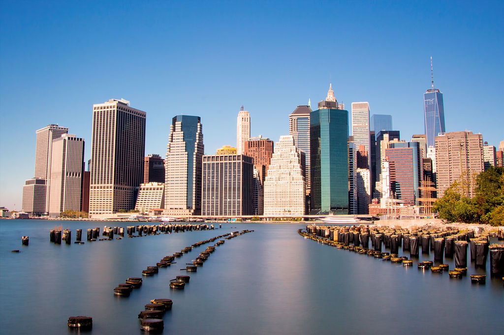
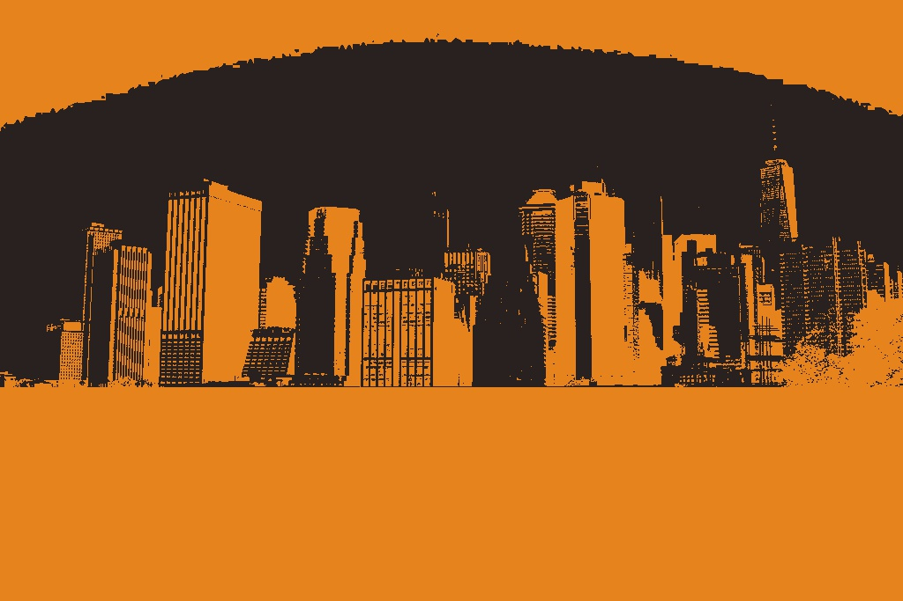

# Image-Flattener
Produce cool flattened effect from standard image

This application takes an image like this …

… and turns it into this ….

There are some small tweaks to be made per image with the rectangle being drawn.
This removes the noise from the water and other surroundings.